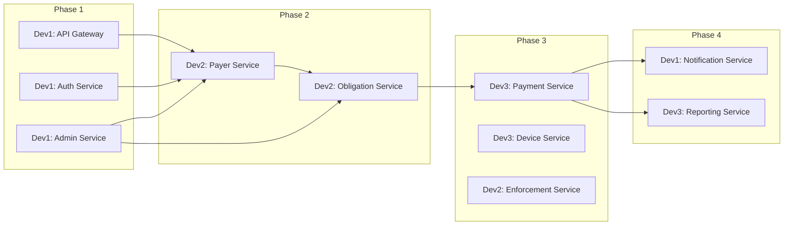

# Three-Developer Assignment Plan – POS Platform

This document assigns work across **3 developers** so the platform can be built in phases with clear ownership, minimal blocking, and defined integration points. It follows the task distribution in the POS Project Stretcher and aligns with [POS-Platform-PRD.md](POS-Platform-PRD.md) phases and [POS-Schema-Separation.md](../data/POS-Schema-Separation.md) schema ownership.

---

## 1. Developer Roles and Service Ownership

| Developer       | Role                | Owned microservices                                                                                                              | Owned DB schemas                                                  |
| --------------- | ------------------- | -------------------------------------------------------------------------------------------------------------------------------- | ----------------------------------------------------------------- |
| **Developer 1** | Platform & Security | Authentication & User Service (`identity-service`), Administrative Service (`administrative-service`), Notification Service, API Gateway (`api-gateway`) | `identity`, `administrative` (Notification uses Redis, no schema) |
| **Developer 2** | Core Tax System     | Payer Service (`payer-service`), Obligation Service (incl. Receipts, `obligation-service`), Enforcement Service (`enforcement-service`)                  | `payer`, `obligation`, `enforcement`                              |
| **Developer 3** | Payment & Financial | Payment Service (`payment-service`), Device Service (POS, `device-service`), Reporting Service (`reporting-service`)                                        | `payment`, `device`, `reporting`                                  |

---

## 2. Dependency Order and Phase Alignment

- **Phase 1**: Developer 1 delivers API Gateway, Auth, and Administrative services so others can authenticate and resolve admin units/roles.
- **Phase 2**: Developer 2 delivers Payer and Obligation services (depends on identity + administrative).
- **Phase 3**: Developer 3 delivers Payment and Device services; Developer 2 delivers Enforcement (depends on payer/obligation).
- **Phase 4**: Developer 1 delivers Notification; Developer 3 delivers Reporting/Audit (both consume events from other services).

---

## 3. Per-Developer Responsibility Matrix

### 3.1 Developer 1 – Platform & Security

**Backend (Spring Boot, Java 21, Gradle)**  
- Implemented primarily in `services/identity-service`, `services/administrative-service`, and `services/api-gateway`.

- **Authentication & User Service**
  - Login/logout, JWT issue and validation, user CRUD, role and permission management, user status (activate/suspend).
  - Schema: `identity` (users, roles, role_permissions).
  - Expose: `POST/GET/PUT/PATCH/DELETE` for users; login/logout; role/permission APIs as per PRD.
- **Administrative Service**
  - Administrative units hierarchy (CRUD), rule versions (tax/penalty rules) CRUD and evaluation for tax calculation.
  - Schema: `administrative` (administrative_units, rule_versions).
  - Expose: admin-units and rules APIs; internal or shared contract for "evaluate rule" used by Obligation Service.
- **Notification Service**
  - Consume Kafka events (e.g. payment.confirmed, obligation.overdue, dispute.created), send email/SMS/push; optional in-app queue in Redis.
  - No PostgreSQL schema; use Redis and/or Kafka consumer offset.
- **API Gateway**
  - Spring Cloud Gateway: route to the above services and to Dev 2 and Dev 3 services; apply JWT validation and (optionally) rate limiting.
  - Shared gateway config so Dev 2 and Dev 3 can register routes.

**Front-end (Electron + React)**

- **Admin Desktop – Platform & Config**
  - Screens: Login, user management, role/permission management, administrative units tree, tax/penalty rules CRUD.
  - Consumes: Auth, User, Administrative APIs via gateway.

**Shared / Infra (led by Dev 1 in Phase 1)**

- Bootstrap: Docker Compose (or similar) for PostgreSQL (single DB with schemas), Redis, Kafka (and optionally RabbitMQ if used).
- Create all schemas in order per [POS-Schema-Separation.md](POS-Schema-Separation.md) (identity, administrative, payer, obligation, payment, device, enforcement, reporting).
- Document gateway base URL and auth flow (login → JWT → Authorization header) for Dev 2 and Dev 3.

**Technologies**

- Spring Security, JWT, Redis, Kafka consumer, Spring Cloud Gateway.

---

### 3.2 Developer 2 – Core Tax System

**Backend**  
- Implemented primarily in `services/payer-service`, `services/obligation-service`, and `services/enforcement-service`.

- **Payer Service**
  - Payer and asset CRUD, search, link assets to payers.
  - Schema: `payer` (payers, assets).
  - Depends on: administrative (admin_unit_id); no dependency on obligation/payment.
- **Obligation Service**
  - Obligation lifecycle (create, update, status transitions), obligation_events, disputes, adjustment requests, adjustments, approvals, receipt generation and retrieval.
  - Schema: `obligation` (obligations, obligation_events, disputes, obligation_adjustment_requests, obligation_adjustments, approvals, receipts).
  - Depends on: identity (user refs), administrative (units, rule_versions), payer (payers, assets).
  - Integrates with: Payment Service (receipts reference payment.payments; consume payment.confirmed / receipt.generated events or HTTP callback as agreed).
- **Enforcement Service**
  - Enforcement actions CRUD, evidence file upload/link, GPS and metadata.
  - Schema: `enforcement` (enforcement_actions, evidence_files).
  - Depends on: identity, administrative, payer, obligation (for obligation_id).

**Front-end**

- **Admin Desktop – Tax & Enforcement**
  - Screens: Payer list/search, payer and asset CRUD, obligation list/detail, dispute list/resolution, adjustment requests, enforcement action list and evidence viewer.
  - Consumes: Payer, Obligation, Enforcement APIs via gateway.
- **Field Agent Mobile App (Flutter)**
  - Full ownership of this app: login (calls Dev 1 auth), assigned admin unit and (later) POS device, payer lookup and registration, asset registration, obligation view, dispute submission, enforcement action creation with GPS and photo/evidence, offline capture and sync.
  - Consumes: Auth, Administrative (units), Payer, Obligation, Enforcement; later Payment and Device for collection flows.

**Technologies**

- Spring Boot, PostgreSQL (payer, obligation, enforcement schemas), JPA, file storage (evidence), Kafka producer (obligation.created, dispute.created, etc.) and possibly consumer for payment events if receipt generation is event-driven.

---

### 3.3 Developer 3 – Payment & Financial System

**Backend**  
- Implemented primarily in `services/payment-service`, `services/device-service`, `services/reporting-service`, and `services/notification-service`.

- **Payment Service**
  - Payment recording (digital, POS, cash), payment_allocations to obligations, officer_cash_sessions, cash_handovers.
  - Schema: `payment` (payments, payment_allocations, officer_cash_sessions, cash_handovers).
  - Depends on: identity, administrative, payer, obligation (for allocation).
  - Publishes: payment.initiated, payment.confirmed, payment.failed, cash.session.opened/closed.
- **Device Service (POS)**
  - POS terminal CRUD, terminal assignments to users, pos_transactions log.
  - Schema: `device` (pos_terminals, pos_terminal_assignments, pos_transactions).
  - Depends on: identity, administrative.
- **Reporting Service**
  - Audit log write/read, tax_registry_snapshot and fine_registry_snapshot (materialized or tables), report APIs.
  - Schema: `reporting` (audit_logs, tax_registry_snapshot, fine_registry_snapshot).
  - Consumes: Kafka events from all services to maintain snapshots and audit trail; or receives audit events via API.

**Front-end**

- **Admin Desktop – Payments & Reports**
  - Screens: Payment list/filters, cash session list and reconciliation, POS device and assignment management, dashboards, tax/fine registry reports, audit log viewer, export (CSV/PDF).
  - Consumes: Payment, Device, Reporting APIs via gateway.
- **Citizen Mobile App (Flutter)**
  - Full ownership: registration/onboarding, view obligations, initiate payment (digital), view receipts and history, notifications (UI only; push payload from Dev 1's Notification Service).
  - Consumes: Auth (Dev 1), Payer (Dev 2 – for linking profile), Obligation (Dev 2), Payment (Dev 3), Receipts (Dev 2 or Payment/Dev 3 as agreed).

**Technologies**

- Spring Boot, Kafka producer/consumer, payment workflow logic, reporting queries, file export.

---

## 4. Phased Task Breakdown (What Each Developer Does When)

### Phase 1 – Core Platform (everyone aligns on gateway + auth)

| Developer | Tasks |
| --------- | ----- |
| **Dev 1** | Implement API Gateway project; implement Auth Service (login, JWT, user/role CRUD); implement Administrative Service (admin units + rules CRUD); create DB schemas `identity`, `administrative`; Docker Compose for DB, Redis, Kafka; document API base URL and auth. |
| **Dev 2** | Set up Payer and Obligation service projects (skeletons), DB schemas `payer`, `obligation` (and later `enforcement`); no gateway routes yet; can stub admin/identity for local testing. |
| **Dev 3** | Set up Payment and Device service projects (skeletons), DB schemas `payment`, `device`, `reporting`; same stub approach. |

**Outcome**: Admins can log in via gateway and manage users, roles, and administrative units/rules in the Admin Desktop (Dev 1).

---

### Phase 2 – Core Revenue (payer + obligation)

| Developer | Tasks |
| --------- | ----- |
| **Dev 1** | Register Payer and Obligation service routes in gateway; ensure JWT and roles work for Dev 2's APIs. Optional: start Notification Service skeleton (Kafka consumer, no channels yet). |
| **Dev 2** | Implement Payer Service (CRUD, search); implement Obligation Service (obligation lifecycle, events, disputes, adjustments, approvals, receipt generation); implement Enforcement Service (actions + evidence). Admin Desktop: payer/asset/obligation/dispute/enforcement screens. Start Field Agent app: login, payer lookup, registration, obligation list. |
| **Dev 3** | Register Payment and Device routes in gateway. Implement Payment Service (record payment, allocation to obligations, call or event to Obligation for receipt); implement Device Service (POS terminal CRUD, assignments). Citizen app: login, view obligations (read-only from Dev 2 APIs). |

**Outcome**: Back-office can manage payers, assets, obligations, disputes, and enforcement; field agent can register payers and view obligations; citizen can view obligations.

---

### Phase 3 – Payment & Field Operations

| Developer | Tasks |
| --------- | ----- |
| **Dev 1** | Notification Service: send email/SMS/push for payment and obligation events; in-app notification API if needed. |
| **Dev 2** | Field Agent app: cash session UI (calls Dev 3), POS payment flow (calls Dev 3), enforcement with GPS and evidence, offline sync. Admin Desktop: any remaining obligation/enforcement screens. |
| **Dev 3** | Payment: cash sessions and handovers, POS transaction logging, allocation to obligations, integration with Obligation for receipts. Device: POS transaction log and assignment lifecycle. Reporting: audit log ingestion (from events or API). Admin Desktop: payment list, cash session reconciliation, POS device management. |

**Outcome**: End-to-end payment (digital, POS, cash), cash reconciliation, POS device management, enforcement with evidence; notifications firing.

---

### Phase 4 – Compliance & Analytics

| Developer | Tasks |
| --------- | ----- |
| **Dev 1** | Notification: retry, channels config, optional digest. Harden gateway and auth. |
| **Dev 2** | Obligation/Enforcement: any remaining dispute or adjustment workflows; Field Agent app polish and offline robustness. |
| **Dev 3** | Reporting: tax_registry and fine_registry snapshots, report APIs, dashboards, audit log search and export. Admin Desktop: dashboards, reports, export. Citizen app: receipts and payment history, notification list. |

**Outcome**: Full reporting, audit trail, and compliance views; all three clients feature-complete for MVP.

---

### 4.1 Definition of Done (per phase)

| Phase | Definition of Done |
| ----- | ------------------ |
| **Phase 1** | An admin can log in through the API Gateway, receive a JWT, and use the Admin Desktop to create/edit users, roles, and administrative units and tax/penalty rules. Dev 2 and Dev 3 have service skeletons and DB schemas created and can run locally with stubbed dependencies. |
| **Phase 2** | An admin can create a payer and an obligation in the Admin Desktop; a field agent can log in on the Field Agent app, search for that payer, and see the obligation. A citizen can log in on the Citizen app and view their obligations (read-only). Disputes and enforcement actions can be created and viewed in the Admin Desktop. |
| **Phase 3** | A field agent can open a cash session, collect a payment (cash or via POS), and close the session with handover; the payment is allocated to obligations and a receipt is generated. Notifications are sent for key events (e.g. payment confirmed). Enforcement actions can be recorded with GPS and evidence from the Field Agent app. |
| **Phase 4** | Dashboards and tax/fine registry reports are available in the Admin Desktop with export. Audit logs are searchable. The Citizen app shows receipts and payment history and in-app notifications. All three clients are feature-complete for MVP and offline/robustness is acceptable for Field Agent. |

---

## 5. Integration and Handoff Rules

- **API contract**
  - Each developer owns the OpenAPI/spec for their services; gateway routes point to their service URLs.
  - Agree on shared DTOs for cross-service IDs (e.g. payer_id, obligation_id) and event payloads (Kafka).
- **Database**
  - Single PostgreSQL instance; schemas created once (Dev 1 or lead) in order per [POS-Schema-Separation.md](../data/POS-Schema-Separation.md).
  - Each developer runs Flyway/Liquibase for their own schema only.
- **Kafka**
  - Topic naming and event payloads agreed up front (e.g. `payment.confirmed`, `obligation.created`).
  - Dev 1 (Notification) and Dev 3 (Reporting) consume events produced by Dev 2 and Dev 3.
- **Clients**
  - One repo (or monorepo) per app: Admin Desktop (Electron), Field Agent (Flutter), Citizen (Flutter).
  - Dev 1: Admin – platform/config; Dev 2: Admin – tax/enforcement + Field Agent app; Dev 3: Admin – payments/reports + Citizen app.
  - Shared: design system and API client helpers (base URL, JWT attachment) maintained together or by Dev 1.
